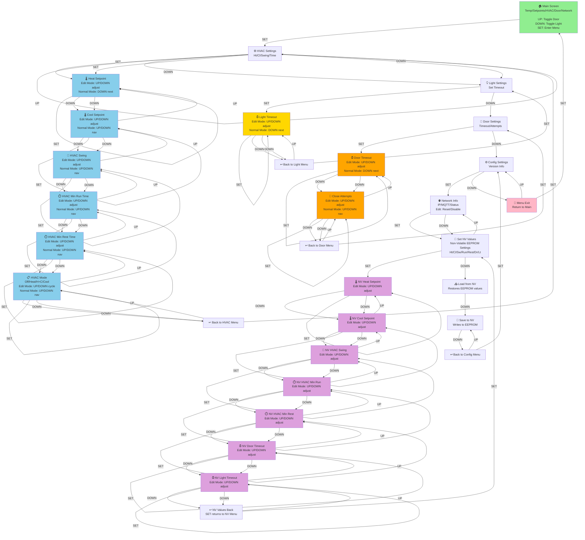

# Garage Control Menu Structure

## Menu Navigation Flowchart

## Key Features

### Button Behavior

- **UP Button**: Navigate up or adjust values in edit mode
- **DOWN Button**: Navigate down or adjust values in edit mode  
- **SET Button**: Enter edit mode, confirm values, or navigate into submenus

### Main Menu Hierarchy

1. **HVAC Settings** - Temperature and system control
2. **Light Settings** - Garage light auto-off timeout
3. **Door Settings** - Door auto-close timeout and attempt limits
4. **Config Settings** - Network info and NV value editing
5. **Menu Exit** - Return to main status screen

### Edit Mode Behavior

When `EditMode` is enabled (toggled by SET button):
- **UP/DOWN** buttons adjust the displayed value
- Values increment/decrement by appropriate steps (1°F for temps, 1 min for timeouts, etc.)

When `EditMode` is disabled:
- **UP/DOWN** buttons navigate between menu items
- The current value is displayed but cannot be changed

### Non-Volatile (NV) Settings

The SetNV submenu allows editing EEPROM-backed settings independently from live values:
- Changes only affect in-RAM NV members
- Changes persist to EEPROM only when **SaveNV** is executed
- **LoadNV** restores all NV values from EEPROM

### Auto-Timeout

The menu automatically returns to the **Main** screen after `MENU_TIMEOUT` milliseconds of inactivity.

